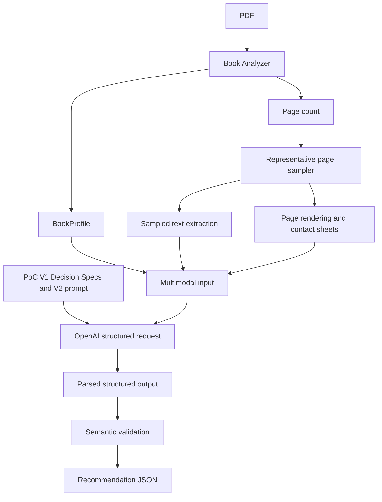

# Current architecture

This document describes the standalone PoC V1 implementation. It does not describe an ADT Studio integration or a future compatibility engine.

## Entry point and data flow

[`src/recommend-openai.ts`](../src/recommend-openai.ts) parses arguments, validates the local PDF path and required `OPENAI_API_KEY`/`OPENAI_MODEL`, and coordinates the stages. The chosen variant sets the Decision Specs, promptVersion, and isolated output paths. `poc-v1` must be selected explicitly because the CLI default remains historical `v1`.

The analyzer opens the PDF and visits every page. It aggregates text, image-operation, layout, and activity proxies into one `BookProfile`. Sampling then chooses up to three non-overlapping page pairs from the page count. Text extraction and rendering open the PDF in separate passes for those selected pages. Rendered images are saved as contact-sheet PNGs and sent with sampled text and the global profile. The full PDF is not directly attached to the OpenAI request.

The V2 prompt contains fixed ambiguity-aware instructions, selected Decision Knowledge, and the requested user language. The user input contains the `BookProfile`, sampled page text, contact-sheet images, and task. **All six decisions share a single LLM context and a single request.** `store` is set to `false`; SDK retries are disabled. The OpenAI structured-output schema constrains the response shape and valid option IDs.

After parsing, the V2 validator checks choice and alternative IDs, confidence/alternative consistency, and evidence-page membership, ordering, and uniqueness. It does not judge whether the evidence truly supports a recommendation or resolve compatibility across decisions. The CLI serializes the recommendations together with profile, evidence metadata, model and prompt version, usage, and timings.

## Module responsibilities

| Path | Responsibility |
| --- | --- |
| [`src/analyzer/`](../src/analyzer/) | Per-page PDF inspection, heuristic signals, and `BookProfile` aggregation |
| [`src/decision/`](../src/decision/) | Stable option IDs, Decision Specs, and canonical `POC_V1_DECISION_SPECS` |
| [`src/recommendation/representative-pages.ts`](../src/recommendation/representative-pages.ts) | Deterministic pair selection and limited sampled text |
| [`src/recommendation/page-renderer.ts`](../src/recommendation/page-renderer.ts) | Page rendering, side-by-side PNG contact sheets, and evidence files |
| [`src/recommendation/openai-prompt.ts`](../src/recommendation/openai-prompt.ts) | Decision Knowledge, V2 instructions, language instruction, and multimodal input |
| [`src/recommendation/openai-schema.ts`](../src/recommendation/openai-schema.ts) | Structured-output request schema and post-parse semantic checks |
| [`src/recommendation/openai-recommender.ts`](../src/recommendation/openai-recommender.ts) | One shared V2 OpenAI execution path plus historical compatibility wrappers |
| [`src/recommendation/variant-config.ts`](../src/recommendation/variant-config.ts) and [`openai-cli.ts`](../src/recommendation/openai-cli.ts) | Typed variant registry, CLI resolution, and output-path selection |
| [`src/experiments/`](../src/experiments/) | Executable historical Decision Specs and variant configurations needed to reproduce prior runs |
| [`experiments/`](../experiments/) | Human-readable history of experiments, results, and selection |
| [`evaluation/`](../evaluation/) | Frozen manually validated benchmark and its scoring limits |

`src/experiments/` contains executable definitions; `experiments/` contains records of what was tested and learned. Both are retained intentionally. Stable product-facing definitions come from `src/decision/` and the `poc-v1` entry in the recommendation variant registry. Historical variants remain selectable without changing the stable composition.

## Current boundary with ADT Studio

The PoC does not reuse ADT Studio extraction artifacts, run the ADT conversion pipeline, provide a UI or human override workflow, or implement a final compatibility/constraint resolver. A model response can pass the current output checks while still needing human assessment against ADT semantics. Historical [`specs/`](../specs/) Markdown files provide domain context; runtime TypeScript Decision Specs determine the exact knowledge sent to the model.
